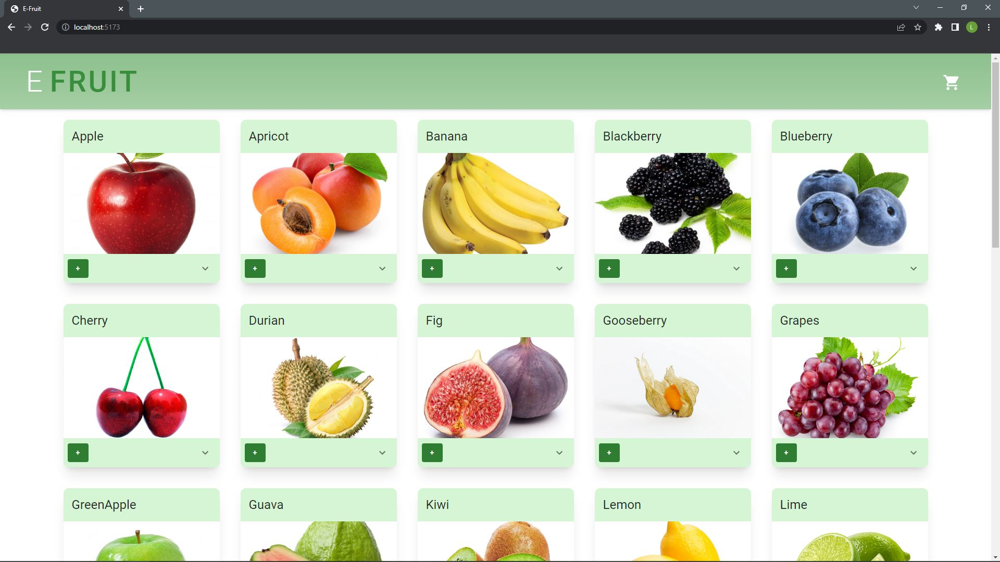
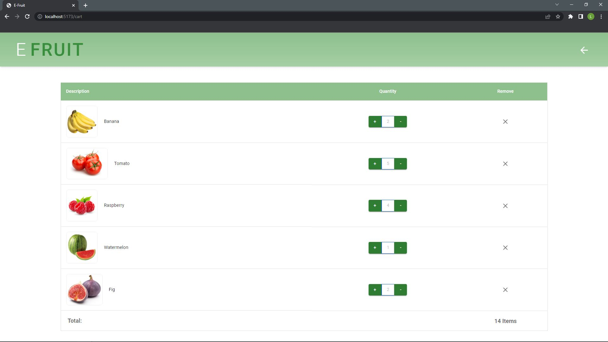
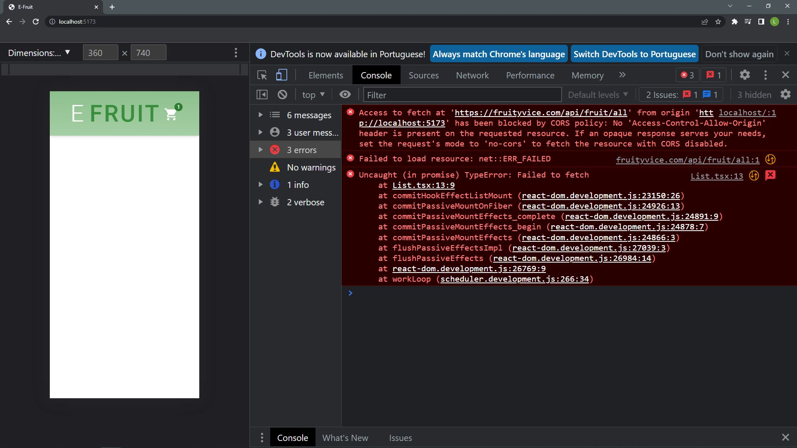

# EFruit
Aplicação Web de uma hortifrut desenvolvida em React, como desafio da empresa Frexco, utilizando Typescript e Material UI.
<hr>

### Página Inicial


### Página do Carrinho

<hr>

### Erro na Api
Ao fazer a requisição para obter os dados dados da API através do código abaixo, obtive o seguinte erro:
``` 
useEffect(() => {
      fetch('https://fruityvice.com/api/fruit/all')
      .then(response => response.json())
      .then(data => setFruits(data))
}, []) 
```


Para contornar a situação, copiei os dados da api e criei um ```JSON Server``` que pode ser encontrado dentro da pasta ```services```.
<hr>

## Como iniciar a aplicação?

Para iniciar a aplicação é necessario primeiro instalar suas dependencias.

#### Instalar as Dependencias do JSON Server

- Abra o terminal na pasta services e insira o comando ```npm install```
- Para iniciar o JSON Server basta insirir o comando ```npm start```

#### Instalar as Dependencias da Aplicação

- Abra o terminal na pasta efruit e insira o comando ```npm install```
- Para iniciar a aplicação basta insirir o comando ```npm run dev```
